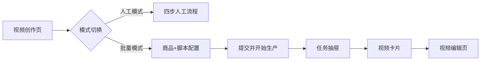
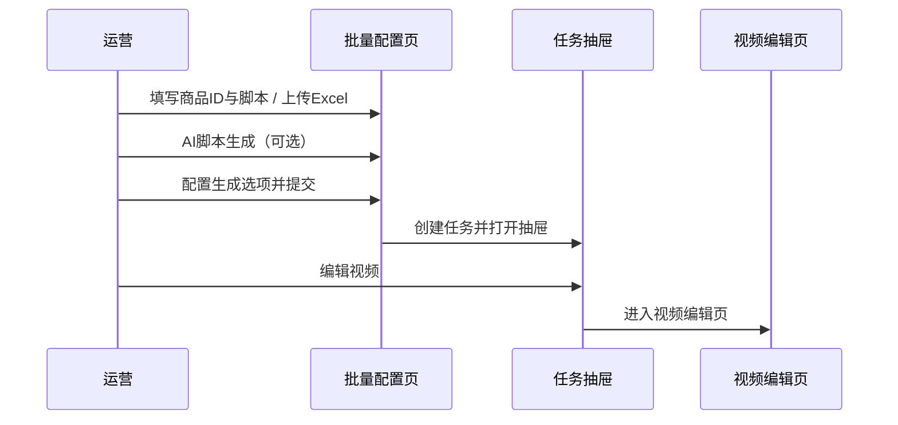

# AIGC 视频工具 — 批量模式 & 视频编辑页 PRD

| 项目 | 说明 |
|------|------|
| 文档版本 | v3.1 |
| 更新日期 | 2026-05-28 |

---

## 1. 背景与目标

### 1.1 背景

运营需在**单商品多条脚本**或**多商品批量**场景下高效产出短视频；视频生成后需在剪辑编辑页识别各时间轴片段所用镜头，并完成文案、音色、BGM 等调整。

### 1.2 目标

| 模块 | 目标 |
|------|------|
| **批量模式** | 多商品 × 多脚本前置配置，一键提交；任务按商品聚合、按脚本展示视频卡片 |
| **视频编辑页** | 时间轴片段展示镜头名称；支持 BGM 库、生成选项与素材替换 |

---

## 2. 术语

| 术语 | 说明 |
|------|------|
| 人工模式 | 四步流程：商品识别 → 卖点 → 脚本 → 参数与生产 |
| 批量模式 | 批量录入商品 ID 与脚本文案后提交生产 |
| 商品行 | 一个商品 ID + 多条脚本文案的配置单元 |
| 镜头名称 | 时间轴片段下方标识该片段镜头/素材语义的文案 |

---

## 3. 用户与场景

| 角色 | 场景 |
|------|------|
| 运营 | 多商品各配置多条脚本，Excel 导入后提交生产 |
| 运营 | 使用 AI 脚本生成或单条重新生成后微调再提交 |
| 运营/剪辑 | 任务列表进入编辑，对照时间轴镜头名核对素材 |
| 运营 | 编辑页调整 BGM、口播文案后提交修改 |

---

## 4. 产品架构



- 两种模式共用任务体系、视频编辑页、生成选项（字幕 / BGM / 四要素 / 尾板）。
- 任务 `productionMode` 为「人工模式」或「批量模式」，列表展示对应徽章。

---

## 5. 批量模式 — 功能需求

### 5.1 模式切换

| 编号 | 需求 | 优先级 |
|------|------|--------|
| FR-BATCH-01-1 | 创作页顶部 Tab：人工模式 / 批量模式 | P0 |
| FR-BATCH-01-2 | 默认进入人工模式；人工模式展示四步流程 | P0 |
| FR-BATCH-01-3 | 批量模式展示商品与脚本配置面板 | P0 |

### 5.2 商品与脚本配置

| 编号 | 需求 | 说明 |
|------|------|------|
| FR-BATCH-02-1 | 商品行 | 商品 ID、AI脚本生成、删除商品 |
| FR-BATCH-02-2 | 默认脚本数 | 新建商品行默认 3 条脚本输入框 |
| FR-BATCH-02-3 | 添加脚本 | 「添加脚本」位于最后一条脚本输入框下方 |
| FR-BATCH-02-4 | 删除脚本 | 单条可删；每商品至少 1 条脚本 |
| FR-BATCH-02-5 | 添加商品 | 支持新增商品行 |
| FR-BATCH-02-6 | 删除商品 | 至少保留 1 个商品行 |
| FR-BATCH-02-7 | 脚本序号 | 展示「脚本 1」「脚本 2」…；标题为「脚本文案（N 条，可继续添加）」 |
| FR-BATCH-02-8 | 单条重新生成 | 每条脚本支持重新生成（需已填商品 ID） |
| FR-BATCH-02-9 | 配置提示 | 实时展示已配置商品数、脚本总数等 |

**业务规则：**

- 每个商品的生产视频条数 = 该商品下有效脚本文案条数（非空）。
- 脚本由运营前置确认；提交后系统完成商品识别、音色与参数配置、视频生产。

### 5.3 AI 脚本生成

| 编号 | 需求 | 说明 |
|------|------|------|
| FR-BATCH-03-1 | 行级生成 | 按当前脚本输入框数量生成对应条数文案 |
| FR-BATCH-03-2 | 校验 | 未填商品 ID 时提示，不发起生成 |
| FR-BATCH-03-3 | 交互 | 生成过程展示 loading，完成后可编辑 |
| FR-BATCH-03-4 | 单条重新生成 | 仅更新当前脚本输入框内容 |
| FR-BATCH-03-5 | 接口 | 入参：商品 ID、生成条数；可选卖点、类目 |

### 5.4 Excel 批量导入

| 编号 | 需求 | 说明 |
|------|------|------|
| FR-BATCH-04-1 | 入口 | 「上传EXCEL」，支持 `.xlsx` / `.xls` |
| FR-BATCH-04-2 | 列 | **商品ID**、**脚本**（表头兼容 id、productId、script、文案等） |
| FR-BATCH-04-3 | 合并 | 同一商品 ID 多行合并为该商品下多条脚本 |
| FR-BATCH-04-4 | 结果 | 按解析结果重建商品行配置 |
| FR-BATCH-04-5 | 模板 | 提供 `上传EXCEL.xlsx` 示例 |

### 5.5 全局生成选项

提交前可配置（默认开启）：字幕、BGM、四要素、尾板。写入任务生成选项，与编辑页语义一致。

### 5.6 提交与任务

| 编号 | 需求 | 说明 |
|------|------|------|
| FR-BATCH-06-1 | 提交按钮 | 「提交并开始生产」 |
| FR-BATCH-06-2 | 校验 | ≥1 个商品；商品 ID 必填；每商品 ≥1 条有效脚本 |
| FR-BATCH-06-3 | 任务粒度 | 每个商品 1 条任务；描述含商品 ID、脚本条数 |
| FR-BATCH-06-4 | 视频 | 按脚本条数生成视频槽位，`scriptSource` 为「人工脚本」 |
| FR-BATCH-06-5 | 提交后 | 打开任务抽屉，展示本批次新建任务 |
| FR-BATCH-06-6 | 任务状态 | 提交后任务为「任务成功」、进度 100% |
| FR-BATCH-06-7 | 反馈 | 提示商品任务数与视频总条数 |

### 5.7 任务列表

| 编号 | 需求 | 说明 |
|------|------|------|
| FR-BATCH-07-1 | 模式徽章 | 「批量模式」/「人工模式」 |
| FR-BATCH-07-2 | 商品信息 | 商品 ID、视频条数 |
| FR-BATCH-07-3 | 视频卡片 | 每条脚本对应一张卡片；支持编辑、预览、保存 |
| FR-BATCH-07-4 | 脚本摘要 | 任务展示首条脚本摘要 |

---

## 6. 批量模式 — 页面结构

```
批量模式面板
├── 说明：批量配置商品 ID 与脚本文案
├── 商品与脚本
│   ├── [上传EXCEL] [添加商品]
│   └── 商品行 × N
│       ├── 商品 ID + AI脚本生成 + 删除商品
│       └── 脚本列表 + 添加脚本
├── 生成选项（字幕 / BGM / 四要素 / 尾板）
└── [提交并开始生产] + 配置提示
```



---

## 7. 视频编辑页 — 功能需求

### 7.1 页面结构

| 编号 | 需求 | 说明 |
|------|------|------|
| FR-EDIT-01-1 | 左侧「视频优化」 | 脚本文案、音色、口播语速/音量、生成选项 |
| FR-EDIT-01-2 | 顶栏 | 「提交修改」、关闭 |
| FR-EDIT-01-3 | 预览区 | 视频播放；字幕层、四要素图随生成选项显隐 |

### 7.2 脚本文案与音色

- 脚本文案编辑，字数统计。
- 音色：男性 / 女性 / 中性 Tab + 网格选择。
- 口播语速、口播音量滑条。

### 7.3 生成选项与 BGM

| 编号 | 需求 | 说明 |
|------|------|------|
| FR-EDIT-03-1 | 生成选项 | 字幕、BGM、四要素、尾板 |
| FR-EDIT-03-2 | 更换 BGM | 开启 BGM 时展示「更换BGM」，打开 BGM 库弹窗 |
| FR-EDIT-03-3 | BGM 库 | 曲名、创作者、品类、时间筛选；分页；试听 |
| FR-EDIT-03-4 | 已选 BGM | 展示当前所选 BGM 名称 |
| FR-EDIT-03-5 | 预览联动 | 选项控制字幕、四要素等预览显隐 |

### 7.4 时间轴镜头名称

| 编号 | 需求 | 说明 |
|------|------|------|
| FR-EDIT-04-1 | 展示 | 每个时间轴片段缩略图**下方**展示镜头名称 |
| FR-EDIT-04-2 | 默认名称 | 与分镜一致，示例：开场介绍、面料质感展示、荷叶领口设计、搭配场景展示 |
| FR-EDIT-04-3 | 布局 | 上：缩略图 + 片段序号；下：镜头名称（过长省略） |
| FR-EDIT-04-4 | 选中 | 选中片段时镜头名称高亮；提示「已选择：{镜头名称}」 |
| FR-EDIT-04-5 | 悬停 | 展示完整镜头名与操作说明 |
| FR-EDIT-04-6 | 替换 | 双击打开素材库/上传；替换后同步更新缩略图与镜头名称 |
| FR-EDIT-04-7 | 素材库替换 | 镜头名称取素材标题（或名称字段） |
| FR-EDIT-04-8 | 上传替换 | 镜头名称取上传文件名（无扩展名） |
| FR-EDIT-04-9 | 新增片段 | 时间轴「+」新增片段；默认名称「镜头{N}」 |

**时间轴片段数据：**

```typescript
interface TimelineSegment {
  id: number;
  thumbnail: string;
  lensName: string;
}
```

**接口要求：**

- 任务下发 `timelineSegments[]`：`segmentId`、`lensId`、`lensName`、`materialUrl`、`duration`。
- 替换素材接口返回更新后的 `lensName`（或等价素材元数据）。

### 7.5 时间轴交互

| 操作 | 行为 |
|------|------|
| 单击 | 选中片段，切换预览内容 |
| 双击 | 打开视频替换（素材库 / 上传） |
| 添加 | 追加片段及默认镜头名 |

---

## 8. 视频编辑页 — 线框

```
┌─────────────────────────────────────────────────────────────┐
│ AI创作工具 > 视频剪辑          [提交修改] [×]  用户         │
├──────────────┬──────────────────────────────────────────────┤
│ 视频优化      │           视频预览区                          │
│ 脚本文案      │                                              │
│ 音色 / 语速   │                                              │
│ 生成选项      │                                              │
│  [更换BGM]    │                                              │
├──────────────┴──────────────────────────────────────────────┤
│ [+] 00:00:00                                                 │
│ ┌────┐ ┌────┐ ┌────┐ ┌────┐                                 │
│ │ 1  │ │ 2  │ │ 3  │ │ 4  │  缩略图 + 序号                  │
│ └────┘ └────┘ └────┘ └────┘                                 │
│ 开场介绍 面料质感 荷叶领口 搭配场景                            │
└─────────────────────────────────────────────────────────────┘
```

---

## 9. 数据模型

### 9.1 批量任务

```typescript
interface BatchTask {
  id: number;
  title: string;
  description: string;
  status: string;
  productionMode: '批量模式' | '人工模式';
  productId: string;
  scripts: string[];
  script: string;
  videoCount: number;
  videos: TaskVideoSlot[];
  automationOptions: {
    subtitles: boolean;
    bgm: boolean;
    flowerText: boolean;
    endBoard: boolean;
  };
}

interface TaskVideoSlot {
  id: number;
  title: string;
  script: string;
  scriptSource: string;
  status: string;
  thumbnail: string;
}
```

---

## 10. 后端接口建议

### 10.1 创建批量批次

`POST /api/batch/batches`

```json
{
  "items": [
    { "productId": "6921298477540574538", "scripts": ["脚本A", "脚本B"] }
  ],
  "generationOptions": {
    "enableSubtitles": true,
    "enableBGM": true,
    "enableFlowerText": true,
    "enableEndBoard": true
  }
}
```

### 10.2 Excel 导入

`POST /api/batch/import-excel`（multipart），或前端解析后调用 10.1。

### 10.3 AI 脚本生成

`POST /api/scripts/generate` — 入参：`productId`、`count`、可选 `regenerateIndex`。

### 10.4 编辑时间轴

`GET /api/videos/{videoId}/timeline` — 返回 `segments[]`（含 `lensName` 等）。

### 10.5 替换片段

`PUT /api/videos/{videoId}/timeline/segments/{segmentId}`

---

## 11. 验收标准

### 11.1 批量模式

- [ ] 人工 / 批量 Tab 切换，展示对应配置面板
- [ ] 默认 3 条脚本，可增删脚本与商品行
- [ ] 填写商品 ID 后可 AI 生成、单条重新生成
- [ ] Excel 两列导入，同商品 ID 合并多脚本
- [ ] 提交校验：商品 ID、脚本必填规则生效
- [ ] 任务抽屉展示本批次任务，徽章为「批量模式」
- [ ] 每商品视频卡片数 = 脚本条数

### 11.2 视频编辑页

- [ ] 左侧为视频优化区（脚本文案、音色、生成选项）
- [ ] 时间轴每片段下方显示镜头名称
- [ ] 选中片段时镜头名高亮，提示含镜头名
- [ ] 素材库/上传替换后镜头名称与缩略图同步更新
- [ ] BGM 库可选曲并回显名称
- [ ] 生成选项控制字幕、四要素预览显隐

---

## 12. 成功指标

| 指标 | 说明 |
|------|------|
| 批量配置效率 | 单日可提交商品数、脚本总条数 |
| Excel 使用率 | 大批量场景 Excel 导入占比 |
| 素材误用率 | 借助镜头名称识别后的返工下降 |
| 脚本一次通过率 | 前置确认后无需二次改脚本的比例 |
